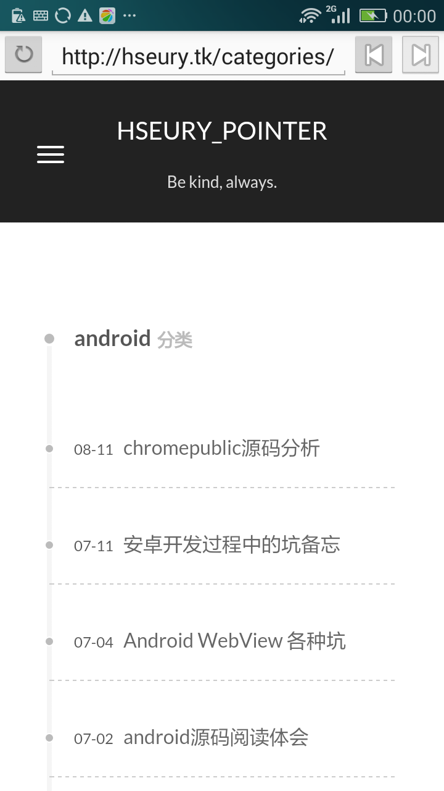

# EasyBrowser
EasyBrowser is an android application, supporting basic browser function, based on chromium android contentshell UI.

## function list ( realized function is struck off )

- ~~surfing the web page in single tab~~

- ~~support x5 WebView~~

- ~~support x5 / system WebView switch~~

- support multi-tab web surfing

- ~~progress bar~~

- remember recent input in address bar

- support downloading

# EasyBrowser
EasyBrowser是一个安卓应用，提供最简单的浏览器功能，基于chromium项目的android contentshell ui。

## 功能清单（ 划去的表示功能已完成）

- ~~单Tab查看网页~~

- ~~使用X5内核~~

- ~~X5内核/系统WebView可切换~~

- 多Tab浏览网页

- ~~优化进度条~~

- 存储最近的地址栏输入

- 支持下载功能

# UI sample
